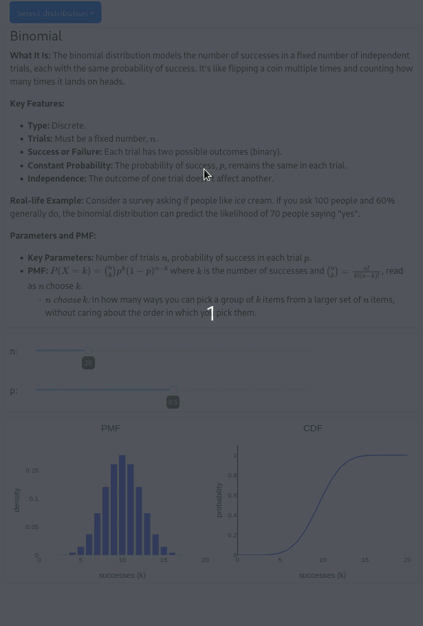

# Dash Distribution Explorer

This repository contains a dash application built to explore different kinds of probability distribution.

Python versions tested are `>=3.10.x` and `<=3.11.x`

## Demo


## Setup
### Linux
```commandline
git clone https://github.com/daeverb/dash-distribution-explorer.git
cd dash-distribution-explorer.git
python -m venv .venv
source .venv/bin/activate
pip install -r requirements.txt
python -m main
```

You should see the following output:
```commandline
Dash is running on http://127.0.0.1:8050/

 * Serving Flask app 'main'
 * Debug mode: on

```

Open your browser and navigate to http://127.0.0.1:8050/